# 💬 AI-Powered Sales Data Chat Assistant

## Overview
An intelligent conversational AI agent that provides real-time access to your sales data through natural language chat. Powered by Google Gemini and integrated with Google Sheets, this workflow enables non-technical users to query and analyze business data simply by asking questions.

## 🎯 What This Workflow Does

This smart assistant provides:
1. **Natural language interface** to query sales data
2. **Real-time access** to Google Sheets database
3. **Conversational AI** with context memory
4. **Intelligent data retrieval** and analysis
5. **Multi-turn conversations** with context retention

## 📊 Workflow Visualization

```mermaid
graph TB
    A[💬 Chat Interface<br/>User Query] --> B[🤖 AI Agent<br/>Query Processing]
    B --> C[🧠 Google Gemini<br/>Language Model]
    B --> D[📊 Google Sheets Tool<br/>Data Access]
    B --> E[🧩 Memory Buffer<br/>Context Window: 10]
    
    D --> F[(📈 Items Sales Data<br/>Spreadsheet)]
    
    C -.understands.-> B
    E -.remembers.-> B
    D -.retrieves.-> B
    
    B --> G[💡 AI Response<br/>Data Insights]
    
    style A fill:#4285f4,stroke:#333,stroke-width:2px,color:#fff
    style B fill:#9b59b6,stroke:#333,stroke-width:3px,color:#fff
    style C fill:#e74c3c,stroke:#333,stroke-width:2px,color:#fff
    style D fill:#34a853,stroke:#333,stroke-width:2px,color:#fff
    style E fill:#f39c12,stroke:#333,stroke-width:2px,color:#fff
    style F fill:#95a5a6,stroke:#333,stroke-width:2px,color:#fff
    style G fill:#1abc9c,stroke:#333,stroke-width:2px,color:#fff
```

## 🔧 Workflow Components

### 1️⃣ Chat Trigger - User Interface
- **Type**: Chat message receiver
- **Function**: Captures user questions in natural language
- **Format**: Simple text-based chat interface

### 2️⃣ AI Agent - Central Intelligence
- **Role**: Orchestrates all workflow components
- **Capabilities**:
  - Understands natural language queries
  - Decides when to access data tools
  - Maintains conversation context
  - Generates intelligent responses

### 3️⃣ Google Gemini Chat Model
- **Model**: Google Gemini (PaLM API)
- **Function**: 
  - Natural language understanding
  - Intent recognition
  - Response generation
  - Data interpretation

### 4️⃣ Simple Memory (Buffer Window)
- **Type**: Conversational memory
- **Window Size**: 10 messages
- **Function**: 
  - Remembers recent conversation history
  - Enables follow-up questions
  - Maintains context across queries
  - Supports multi-turn dialogues

### 5️⃣ Google Sheets Tool
- **Connected Spreadsheet**: "finished_project"
- **Sheet**: "Items Sales Data"
- **Function**: 
  - Retrieves sales records
  - Filters and searches data
  - Returns structured information
  - Enables data-driven responses

## ⚡ How It Works

1. **User asks a question** in natural language
   - Example: "What were our top selling items last month?"
   
2. **AI Agent processes the query** and determines:
   - Does this need data from the spreadsheet?
   - What specific information is needed?
   - Is there context from previous messages?

3. **Google Sheets Tool retrieves data** if needed:
   - Accesses the Items Sales Data sheet
   - Filters relevant rows
   - Returns structured results

4. **Gemini generates a response**:
   - Interprets the retrieved data
   - Formats information clearly
   - Provides insights and summaries

5. **Memory stores the conversation**:
   - Enables follow-up questions
   - Maintains context for 10 messages

## 💬 Example Conversations

### Basic Query
**User**: "Show me the sales data for Product X"  
**AI**: *[Retrieves data from Google Sheets]*  
"Product X had total sales of $15,450 across 234 units last month..."

### Follow-up Question
**User**: "How does that compare to last quarter?"  
**AI**: *[Uses memory of previous context + new data retrieval]*  
"Comparing to last quarter, Product X sales increased by 23%..."

### Analytical Query
**User**: "What are the top 5 performing products?"  
**AI**: *[Analyzes sales data]*  
"Based on the Items Sales Data, the top 5 products are: 1. Product A ($45K), 2. Product B ($38K)..."

## 🎨 Use Cases

- **Sales Analytics**: Query sales performance on-demand
- **Business Intelligence**: Get instant insights without SQL
- **Executive Reporting**: Quick answers for decision-makers
- **Team Collaboration**: Shared access to data insights
- **Customer Service**: Retrieve order and product information
- **Inventory Management**: Check stock levels and trends

## 📈 Key Features

✅ **Natural Language Interface** - No technical skills required  
✅ **Real-time Data Access** - Always current information  
✅ **Conversational Memory** - Context-aware responses  
✅ **Intelligent Analysis** - AI-powered insights  
✅ **Multi-turn Dialogues** - Follow-up questions supported  
✅ **Secure Access** - OAuth2 authenticated

## 🚀 Setup Instructions

1. **Import workflow** into n8n
2. **Connect Google Gemini credentials**
3. **Connect Google Sheets OAuth2**
4. **Verify spreadsheet access** to "finished_project"
5. **Activate the workflow**
6. **Share chat URL** with team members

## 🔐 Security Considerations

- OAuth2 authentication for Google Sheets
- Secure API credentials for Gemini
- Access control via n8n permissions
- No data stored outside of Google Sheets
- Conversation memory limited to session

## ⚙️ Customization Options

**Expand Memory Window**: Increase from 10 to more messages for longer context  
**Add More Tools**: Connect additional data sources  
**Custom System Prompts**: Adjust AI behavior and personality  
**Multiple Sheets**: Add tools for different datasets  
**Advanced Analytics**: Integrate calculation tools

## 💡 Pro Tips

- **Be specific**: More detailed questions yield better results
- **Use follow-ups**: Leverage the memory for deeper analysis
- **Ask for comparisons**: AI can analyze trends and patterns
- **Request visualizations**: Ask for data in specific formats

## 🎯 Sample Questions You Can Ask

- "What were the total sales for last month?"
- "Which product had the highest sales?"
- "Show me items sold in [specific region]"
- "Compare sales between [Product A] and [Product B]"
- "What's the average sale price for [category]?"
- "List all items sold on [date]"

---

**Status**: ✅ Active  
**Webhook ID**: `24e1e271-2953-42ee-b002-0256ffa3850c`  
**AI Model**: Google Gemini (PaLM)  
**Memory Window**: 10 messages  
**Data Source**: Google Sheets (Items Sales Data)
