# 🎓 AI-Powered CV Grading & Review Automation

## Overview
An intelligent CV evaluation system that uses Google Gemini AI to analyze resumes against specific domain requirements. The workflow automatically extracts CV content, evaluates candidate suitability, generates professional feedback, and delivers comprehensive results via email.

## 🎯 What This Workflow Does

This advanced automation provides:
1. **Automated CV submission portal** with domain selection
2. **PDF text extraction** for content analysis
3. **AI-powered evaluation** using Google Gemini 2.0
4. **Professional feedback generation** with scoring (1-10)
5. **Email delivery** with original CV attachment and review

## 📊 Workflow Visualization

```mermaid
graph TB
    A[📄 CV Submission Form<br/>PDF Upload + Domain] --> B[🔍 PDF4me<br/>Text Extraction]
    A --> C[🔄 Merge Node<br/>Data Combination]
    B --> D[🤖 Google Gemini AI<br/>CV Analysis & Scoring]
    D --> C
    C --> E[📧 Gmail<br/>Send Review + CV]
    
    style A fill:#4285f4,stroke:#333,stroke-width:2px,color:#fff
    style B fill:#ff6b6b,stroke:#333,stroke-width:2px,color:#fff
    style D fill:#9b59b6,stroke:#333,stroke-width:2px,color:#fff
    style C fill:#f39c12,stroke:#333,stroke-width:2px,color:#fff
    style E fill:#ea4335,stroke:#333,stroke-width:2px,color:#fff
```

## 🔧 Workflow Components

### 1️⃣ Form Trigger - CV Submission Portal
- **Title**: "CV SUBMISSION"
- **Description**: "Submit your CV here, we will review it"
- **Fields**:
  - **CV Upload**: PDF only, required
  - **Domain Selection**: Dropdown with options:
    - AI/ML
    - Web/Mobile App
    - Cloud Computing
    - Blockchain

### 2️⃣ PDF4me - Text Extraction
- **Function**: Converts PDF to extractable text
- **Input**: Uploaded CV file
- **Output**: Plain text content for AI analysis

### 3️⃣ Google Gemini AI - CV Analysis
- **Model**: Gemini 2.0 Flash
- **Role**: Expert HR assistant and career advisor
- **Analysis Includes**:
  - CV content relevance to selected domain
  - Skills assessment
  - Experience evaluation
  - Suitability scoring (1-10 scale)
- **Output**: Two-line professional remark
- **Token Limit**: 90 tokens (concise feedback)

### 4️⃣ Merge Node
- **Function**: Combines AI analysis with original form data
- **Purpose**: Ensures complete information for email

### 5️⃣ Gmail - Review Delivery
- **Recipient**: nabirakharal@gmail.com
- **Subject**: "CV REVIEW"
- **Content**: AI-generated evaluation and score
- **Attachment**: Original CV (PDF)

## ⚡ How It Works

1. **Candidate submits CV** through the web form and selects their domain of interest
2. **PDF text is extracted** using PDF4me service
3. **AI analyzes the CV** content against the selected domain:
   - Evaluates technical skills relevance
   - Assesses experience alignment
   - Generates a score from 1-10
   - Creates a professional two-line summary
4. **Results are merged** with submission data
5. **Email is sent** with the review and original CV attached

## 🎨 Use Cases

- **Recruitment Screening**: Automate initial CV reviews
- **Career Services**: Provide quick feedback to job seekers
- **HR Departments**: Handle high-volume applications efficiently
- **Educational Institutions**: Grade student CVs and portfolios
- **Consulting Services**: Offer CV review as a service

## 📋 AI Analysis Criteria

The Gemini AI evaluates CVs based on:

✅ **Relevance** to selected domain  
✅ **Technical skills** alignment  
✅ **Experience** depth and quality  
✅ **Professional presentation**  
✅ **Domain-specific expertise**

## 💡 Sample AI Output

**For AI/ML Domain (Score: 8/10)**
> "Strong foundation in machine learning frameworks and practical project experience. Python proficiency and deep learning expertise align well with AI/ML requirements, though more production deployment experience would enhance candidacy."

## 🚀 Setup Instructions

1. **Import workflow** into n8n
2. **Configure credentials**:
   - PDF4me API account
   - Google Gemini API key
   - Gmail OAuth2
3. **Customize email recipient** if needed
4. **Activate the workflow**
5. **Share form URL** with candidates

## 📈 Benefits

✅ **Instant CV evaluation** - Results in seconds  
✅ **Unbiased AI assessment** - Consistent criteria  
✅ **Scalable solution** - Handle unlimited submissions  
✅ **Professional feedback** - Clear, actionable insights  
✅ **Time-saving** - Automate screening process  
✅ **Data-driven decisions** - Objective scoring system

## 🔐 Privacy & Security

- PDFs are processed securely via PDF4me
- AI analysis is confidential
- CVs are delivered only to authorized email
- No permanent storage of sensitive data
- GDPR-compliant processing

## 🎯 Customization Options

**Adjust AI Prompt**: Modify system message for different evaluation criteria  
**Change Scoring Range**: Adjust from 1-10 to other scales  
**Add More Domains**: Expand dropdown options  
**Multiple Recipients**: CC/BCC additional reviewers  
**Custom Templates**: Modify email formatting

---

**Status**: ⚠️ Inactive (Ready for activation)  
**Webhook ID**: `b5128703-2eb6-4f5e-b899-ab74b1a1ec8e`  
**AI Model**: Google Gemini 2.0 Flash
