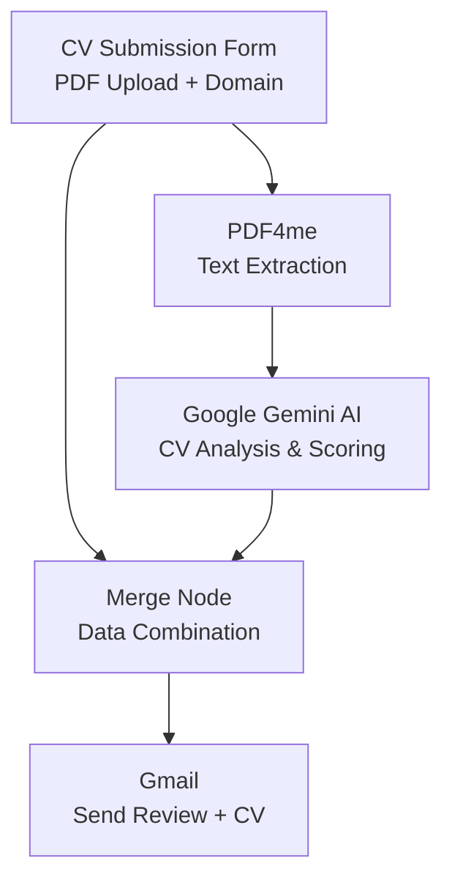
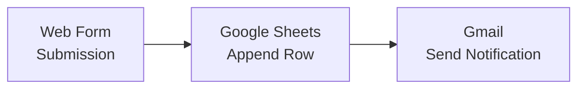
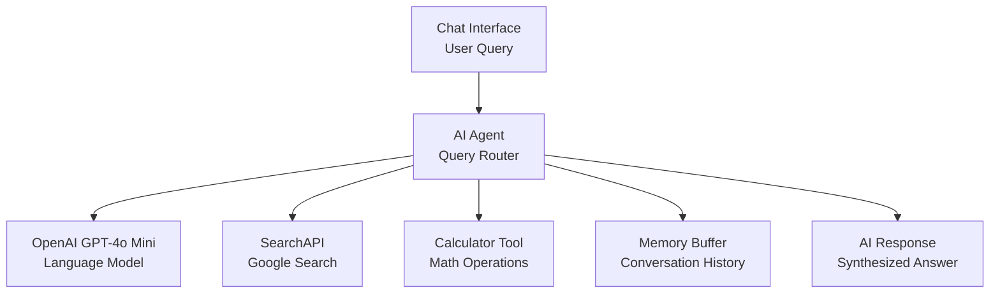
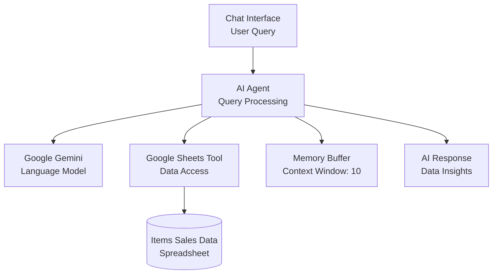

# n8n Workflow Automations by Kingaa

Welcome to the [Khin-96/n8n](https://github.com/Khin-96/n8n) repository. This repository presents a set of operational automations and integrations built with [n8n](https://n8n.io/), designed to streamline business processes such as CV evaluation, web form data collection, AI-based chat assistants, and conversational sales data insights.

---

## Table of Contents
- [CV Grading Automation](#cv-grading-automation)
- [Form Submission to Google Sheets](#form-submission-to-google-sheets)
- [AI-Powered Web Search & Chat](#ai-powered-web-search--chat)
- [Agentic AI Sales Data Chat](#agentic-ai-sales-data-chat)
- [Setup and Security](#setup-and-security)

---

## CV Grading Automation

[Workflow Details](CV/Readme.md)

Automated CV evaluation system utilizing Google Gemini AI to analyze resumes based on domain-specific requirements and deliver feedback via email.

### Workflow Structure
- Candidate submits CV through a web portal (PDF only, selects desired domain: AI/ML, Web/Mobile, Cloud, Blockchain).
- PDF is processed and text extracted.
- Google Gemini AI analyzes CV for technical skills, relevance, and experience.
- AI generates a professional remark and suitability score (1-10).
- Results are merged and delivered to the email recipient.

#### Workflow Diagram

---

## Form Submission to Google Sheets

[Workflow Details](Workflow/Readme.md)

Automates the process of collecting form submissions, storing data in Google Sheets, and sending notification emails.

### Workflow Structure
- Web form captures Name and Phone Number.
- Data is appended automatically to a Google Sheets spreadsheet.
- Email notification is sent upon successful submission.

#### Workflow Diagram

---

## AI-Powered Web Search & Chat

[Workflow Details](Search_API/Readme.md)

Conversational AI assistant workflow integrating GPT-4o Mini, real-time Google Search, calculator operations, and conversation memory.

### Workflow Structure
- User submits query via chat interface.
- Central AI agent routes query to the appropriate module (LLM, search, or calculator).
- Modules perform processing and return synthesized responses to the user.

#### Workflow Diagram

---

## Agentic AI Sales Data Chat

[Workflow Details](Agentic_AI/Readme.md)

Enables users to query Google Sheets sales data using natural language through chat, powered by Google Gemini.

### Workflow Structure
- User sends a query through a text-based chat.
- AI agent parses intent, manages context, and determines data operations.
- AI agent retrieves relevant data from connected spreadsheet and generates structured, conversational responses.

#### Workflow Diagram

---

## Setup and Security

Each workflow's folder contains specific setup instructions regarding integration steps, required credentials, and security practices. Recommendations include:
- Use HTTPS for all webhooks and endpoints
- Limit access to underlying data sources (Google Sheets, emails)
- Ensure compliance with data protection regulations such as GDPR
- Use OAuth or service account credentials for integrations where possible

---

## Further Resources

- [n8n Official Documentation](https://docs.n8n.io)
- Subfolder documentation:
  - [`CV/`](./CV/Readme.md) — CV grading workflow
  - [`Workflow/`](./Workflow/Readme.md) — Form to Google Sheets
  - [`Search_API/`](./Search_API/Readme.md) — AI search assistant
  - [`Agentic_AI/`](./Agentic_AI/Readme.md) — Sales data chat assistant

---

For additional technical details, process diagrams, and setup steps, please refer to the individual workflow README files.
