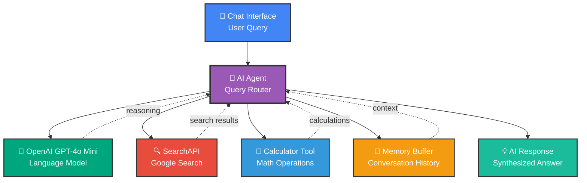

# 🔍 AI-Powered Web Search & Chat Assistant

## Overview
An intelligent conversational AI assistant that combines the power of OpenAI GPT-4o Mini with real-time web search capabilities. This workflow enables users to have natural conversations while the AI can search Google for up-to-date information and perform calculations when needed.

## 🎯 What This Workflow Does

This advanced assistant provides:
1. **Conversational AI interface** powered by GPT-4o Mini
2. **Real-time web search** capability via SearchAPI
3. **Mathematical calculations** with built-in calculator
4. **Context-aware responses** with conversation memory
5. **Multi-tool orchestration** for complex queries

## 📊 Workflow Visualization



## 🔧 Workflow Components

### 1️⃣ Chat Trigger - User Interface
- **Type**: Chat message receiver
- **Function**: Captures user messages and queries
- **Format**: Natural language text input

### 2️⃣ AI Agent - Central Orchestrator
- **Role**: Intelligent router and coordinator
- **Capabilities**:
  - Analyzes user intent
  - Decides which tools to use
  - Combines multiple data sources
  - Generates coherent responses

### 3️⃣ OpenAI Chat Model (GPT-4o Mini)
- **Model**: GPT-4o Mini
- **Provider**: OpenAI
- **Function**: 
  - Natural language understanding
  - Response generation
  - Reasoning and analysis
  - Content synthesis

### 4️⃣ SearchAPI - Google Search Integration
- **Service**: SearchAPI
- **Search Engine**: Google
- **Default Query**: "latest AI news"
- **Capabilities**:
  - Real-time web search
  - Current information retrieval
  - News and updates
  - Fact-checking

### 5️⃣ Calculator Tool
- **Function**: Mathematical operations
- **Operations**: 
  - Basic arithmetic (+, -, ×, ÷)
  - Complex calculations
  - Formula evaluation

### 6️⃣ Simple Memory (Buffer Window)
- **Type**: Conversation memory
- **Function**: 
  - Stores recent messages
  - Enables context-aware responses
  - Supports follow-up questions
  - Maintains conversation flow

## ⚡ How It Works

### Scenario 1: Web Search Query
**User**: "What are the latest developments in AI?"

1. **AI Agent recognizes** need for current information
2. **SearchAPI triggers** Google search for "latest AI news"
3. **Search results returned** with recent articles
4. **GPT-4o Mini synthesizes** information into readable response
5. **User receives** up-to-date summary with key insights

### Scenario 2: Calculation Request
**User**: "What's 15% of $3,450?"

1. **AI Agent identifies** mathematical operation
2. **Calculator tool activated** to compute result
3. **Result returned**: $517.50
4. **GPT-4o Mini formats** response naturally
5. **User receives** clear answer with context

### Scenario 3: Mixed Query
**User**: "Search for AI conferences in 2025 and calculate the cost for 3 attendees at $599 each"

1. **AI Agent uses both tools**:
   - SearchAPI for conference information
   - Calculator for cost computation
2. **Results combined** into unified response
3. **User gets** comprehensive answer with sources

## 💬 Example Interactions

### Current Events
**User**: "What happened in tech news today?"  
**AI**: *[Searches latest tech news]*  
"Today's top tech stories include: [summarized results from web search]..."

### Research Assistance
**User**: "Find information about quantum computing breakthroughs"  
**AI**: *[Performs targeted web search]*  
"Recent quantum computing developments include: [cited sources and summaries]..."

### Quick Calculations
**User**: "If I save $500/month at 5% annual interest, how much in 5 years?"  
**AI**: *[Uses calculator]*  
"With monthly savings of $500 at 5% interest, you'd have approximately $34,000 after 5 years..."

### Follow-up Questions
**User**: "Tell me more about the first result"  
**AI**: *[Uses conversation memory]*  
"Regarding the [previous topic], here are additional details..."

## 🎨 Use Cases

- **Research Assistant**: Get current information on any topic
- **News Aggregation**: Stay updated with latest developments
- **Financial Calculations**: Quick math for budgets and planning
- **Fact-Checking**: Verify information with web sources
- **Learning Aid**: Explore topics with guided research
- **Business Intelligence**: Market research and competitor analysis
- **Content Research**: Gather information for writing and projects

## 📈 Key Features

✅ **Real-time Information** - Access current web data  
✅ **Multi-tool Intelligence** - Combines search + calculations  
✅ **Conversational Memory** - Context-aware responses  
✅ **Powered by GPT-4o Mini** - Advanced language understanding  
✅ **Google Search Integration** - Reliable search results  
✅ **Mathematical Capability** - Built-in calculator  
✅ **Source Attribution** - Citations from web results

## 🚀 Setup Instructions

1. **Import workflow** into n8n
2. **Configure OpenAI credentials**:
   - Add OpenAI API key
   - Select GPT-4o Mini model
3. **Configure SearchAPI credentials**:
   - Add SearchAPI key
   - Set default search parameters
4. **Activate the workflow**
5. **Test with sample queries**
6. **Share chat URL** for team access

## 🔐 API Usage & Costs

- **OpenAI GPT-4o Mini**: Token-based pricing (affordable)
- **SearchAPI**: Per-search pricing
- **Memory**: No additional cost (in-memory)
- **Recommendations**: 
  - Monitor API usage
  - Set rate limits if needed
  - Use caching where possible

## ⚙️ Customization Options

**Change AI Model**: Switch to GPT-4 for more powerful reasoning  
**Adjust Search Parameters**: Customize location, language, time filters  
**Add More Tools**: Integrate additional capabilities:
- Web scraping
- Database queries
- API integrations
- File processing

**Modify Memory**: Adjust buffer size for longer/shorter context  
**Custom System Prompts**: Define AI personality and behavior

## 💡 Pro Tips

1. **Be specific**: Clear queries get better results
2. **Combine queries**: Ask multi-part questions for comprehensive answers
3. **Use follow-ups**: Leverage memory for deeper exploration
4. **Request sources**: Ask AI to cite its information
5. **Iterate**: Refine your questions based on initial responses

## 🎯 Sample Questions

### Web Search Queries
- "What are the current trends in machine learning?"
- "Find the latest news about renewable energy"
- "Search for Python best practices 2025"
- "What's happening in the stock market today?"

### Calculation Queries
- "Calculate compound interest on $10,000 at 7% for 10 years"
- "What's 23% of $4,567?"
- "Convert 150 USD to EUR"
- "Calculate monthly payment for $200k mortgage"

### Combined Queries
- "Find the cost of attending AWS re:Invent and calculate total for 2 people"
- "Search for MacBook Pro prices and compare them"

## 🔄 Workflow Flow

```
User Input → AI Agent Analyzes Intent
              ↓
        Determines Required Tools
              ↓
    ┌─────────┴─────────┐
    ↓                   ↓
SearchAPI          Calculator
(if needed)        (if needed)
    ↓                   ↓
    └─────────┬─────────┘
              ↓
      GPT-4o Mini Processes
              ↓
      Memory Stores Context
              ↓
      Response to User
```

---

**Status**: ⚠️ Inactive (Ready for activation)  
**Webhook ID**: `3005b0b3-5507-4214-aa93-9226398a51c4`  
**AI Model**: OpenAI GPT-4o Mini  
**Search Provider**: SearchAPI (Google)  
**Tools Available**: Web Search, Calculator, Memory
