# 📋 HTML Form Submission to Google Sheets & Email Notification

## Overview
This workflow automates the process of collecting form submissions, storing them in Google Sheets, and sending email notifications. It's perfect for contact forms, lead generation, or any data collection scenario where you need instant notifications and persistent storage.

## 🎯 What This Workflow Does

This automation creates a seamless data collection pipeline that:
1. **Captures form submissions** through a web form
2. **Stores data** automatically in Google Sheets
3. **Sends email notifications** to alert you of new submissions

## 📊 Workflow Visualization

```mermaid
graph LR
    A[📝 Web Form<br/>Submission] --> B[📊 Google Sheets<br/>Append Row]
    B --> C[📧 Gmail<br/>Send Notification]
    
    style A fill:#4285f4,stroke:#333,stroke-width:2px,color:#fff
    style B fill:#34a853,stroke:#333,stroke-width:2px,color:#fff
    style C fill:#ea4335,stroke:#333,stroke-width:2px,color:#fff
```

## 🔧 Workflow Components

### 1️⃣ Form Trigger
- **Type**: HTML Form
- **Fields Collected**:
  - Name (text input)
  - Phone Number (text input)
- **Description**: Web-based form that captures visitor information

### 2️⃣ Google Sheets Integration
- **Action**: Append Row
- **Spreadsheet**: "Untitled spreadsheet"
- **Sheet**: Sheet1
- **Data Stored**:
  - Name
  - Phone number
  - Submission timestamp
  - Form mode

### 3️⃣ Email Notification
- **Service**: Gmail
- **Recipient**: ishwanasir2@gmail.com
- **Subject**: "Automation"
- **Message**: "its a test automation"

## ⚡ How It Works

1. **User fills out the form** with their name and phone number
2. **Data is automatically appended** to your Google Sheets spreadsheet
3. **Email notification is sent** to your Gmail address
4. **Process completes** in seconds, requiring no manual intervention

## 🎨 Use Cases

- **Contact Forms**: Collect customer inquiries
- **Lead Generation**: Capture potential customer information
- **Event Registration**: Gather attendee details
- **Survey Responses**: Store feedback and responses
- **Support Tickets**: Log customer support requests

## 📋 Prerequisites

- n8n instance (cloud or self-hosted)
- Google Account with Sheets access
- Gmail account for notifications
- Form webhook URL (auto-generated)

## 🚀 Setup Instructions

1. **Import the workflow** into your n8n instance
2. **Connect Google Sheets credentials**
3. **Connect Gmail credentials**
4. **Activate the workflow**
5. **Share the form URL** with your audience

## 📈 Benefits

✅ **Real-time data collection**  
✅ **Automatic data organization**  
✅ **Instant notifications**  
✅ **No coding required**  
✅ **Scalable solution**  
✅ **100% automated**

## 🔐 Security Note

This workflow handles user data. Ensure you:
- Use secure connections (HTTPS)
- Comply with data protection regulations (GDPR, etc.)
- Limit access to the Google Sheet
- Use authenticated email credentials

---

**Status**: ✅ Active  
**Webhook ID**: `b614d2b5-e00d-42bc-996e-5b9747d91c13`
